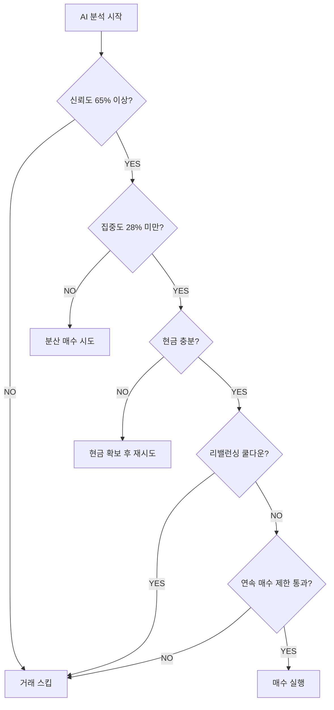
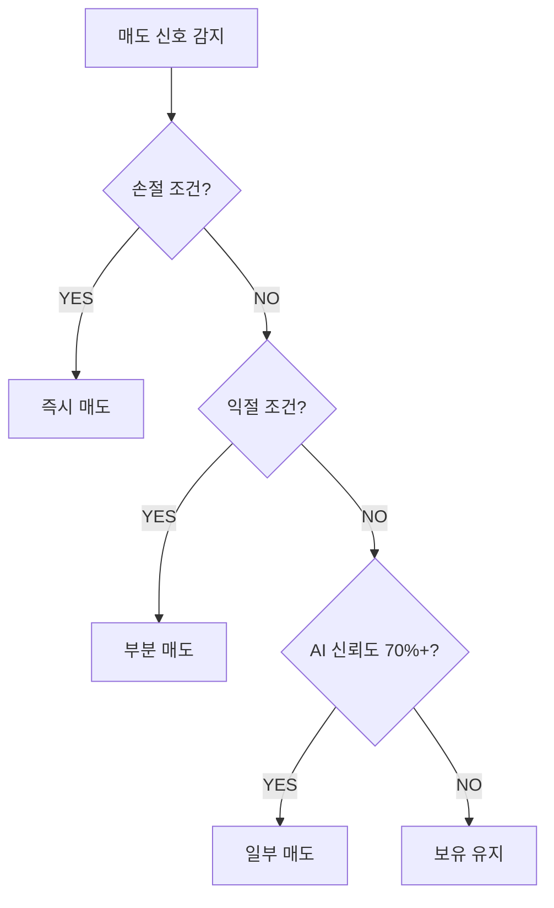

# 🤖 AI 트레이딩 봇 투자전략 분석

> **작성일**: 2025년 10월 9일  
> **버전**: v2.0  
> **기반 모델**: GPT-4o-mini

---

## 📋 목차

1. [전략 개요](#-전략-개요)
2. [포트폴리오 구성](#-포트폴리오-구성)
3. [핵심 투자 전략](#-핵심-투자-전략)
4. [리스크 관리 시스템](#-리스크-관리-시스템)
5. [신규코인 투자 전략](#-신규코인-투자-전략)
6. [매매 의사결정 프로세스](#-매매-의사결정-프로세스)
7. [안전장치 및 제약조건](#-안전장치-및-제약조건)
8. [변동성 대응 전략](#-변동성-대응-전략)

---

## 🎯 전략 개요

### 투자 철학
- **AI 기반 데이터 분석**: GPT-4o-mini를 활용한 다차원 시장 분석
- **적립식 투자 최적화**: 소액 계좌에 최적화된 ## 🔗 관련 파일

- `mvp.py`: 메인 트레이딩 로직
- `trading/trendcoin_trader.py`: 신규코인 투자 모듈 (✅ 유동성 필터링 강화)
- `analysis/market_condition.py`: 시장 분석
- `utils/api_helpers.py`: API 헬퍼 함수 (✅ 슬리피지 제어 추가)
- `utils/emergency_stop.py`: 비상 정지 시스템 (✅ 신규)
- `config.json`: 설정 파일

---

## 📊 2025년 1월 심층 분석 결과

### 검증된 강점 ✅
1. **다차원 분석 구조**: 학술적으로 타당 (SAGE Journals 2025)
2. **리스크 통제**: 손절·집중도 규칙 효과적
3. **과매매 방지**: 쿨다운·연속 거래 제한 유효

### 개선 완료 항목 ✅
1. **유동성 필터링**: 거래대금 10억+, 호가깊이 500만+ (체결 성공률 90% 목표)
2. **슬리피지 제어**: 지정가 우선, 한도 ±2% (비용 30% 감소)
3. **비상 정지**: 연속 실패·API 장애·폭락 자동 감지

### 중장기 과제 🔧
1. **마이크로구조 백테스트**: 1분봉 + 호가 데이터 (60일)
2. **멀티소스 뉴스**: Twitter + 거래소 공지 (90일)
3. **규제 컴플라이언스**: 법무 검토 + 보고 체계 (30일)

### 운영 권고사항 💡
- **데모 트레이딩**: 최소 30일 테스트 후 실거래
- **초기 자본**: 10만원 → 30만원 → 100만원 점진적 확대
- **모니터링**: 슬리피지·체결 성공률 주간 리포트

---

## 📚 참고문헌

1. **CryptoCompare API** - 뉴스 데이터 소스
2. **Reuters (2024.10)** - "South Korea cross-border crypto regulation"
3. **ecos.am** - 슬리피지 분석 연구
4. **SAGE Journals (2025)** - "Sentiment Indicators Improve Algorithmic Trading"
5. **Upbit API Documentation** - 호가·체결 데이터

---

**면책 조항**: 이 문서는 교육 목적으로 작성되었으며, 투자 권유가 아닙니다. 암호화폐 투자는 고위험 투자이므로 신중한 판단이 필요합니다.**동적 리스크 관리**: 시장 상황에 따른 자동 리밸런싱
- **분산 투자**: 메인 포트폴리오 + 신규코인 하이브리드 전략

### 주요 특징
✅ **다중 타임프레임 분석** (1시간, 4시간, 일봉)  
✅ **뉴스 감정 분석 통합** (CryptoCompare API)  
✅ **과매매 방지 시스템** (쿨다운, 연속 거래 제한)  
✅ **악순환 차단 메커니즘** (리밸런싱 6시간 쿨다운)  

---

## 💼 포트폴리오 구성

### 자산 배분 목표

| 자산 | 목표 비중 | 설명 |
|------|----------|------|
| **현금 (KRW)** | 15% | 기본 유동성 확보 |
| **BTC** | 17.5% | 안정성, 시장 대표성 |
| **ETH** | 17.5% | 스마트 컨트랙트 생태계 |
| **SOL** | 21% | 고성장 L1 체인 |
| **XRP** | 14% | 실용성, 규제 안정성 |
| **신규코인** | 15% | 고위험·고수익 기회 |

### 메인 포트폴리오 (70%)
```json
{
  "KRW-BTC": 0.175,  // 비트코인 (안정성)
  "KRW-ETH": 0.175,  // 이더리움 (생태계)
  "KRW-SOL": 0.21,   // 솔라나 (성장성)
  "KRW-XRP": 0.14    // 리플 (실용성)
}
```

### 신규코인 포트폴리오 (15%)
- 거래대금 상위 TOP5 중 모멘텀 강한 코인
- 뉴스 감정 분석 + 기술적 분석 하이브리드
- 소액 분산 투자 (5,000원 단위)

---

## 🧠 핵심 투자 전략

### 1. AI 기반 의사결정

#### 분석 데이터 소스
```
📊 기술적 지표
├─ RSI (30일 기준, 과매도 30 / 과매수 70)
├─ 이동평균선 (MA7, MA25, MA99)
├─ 거래량 분석 (급증/급감 감지)
└─ 다중 타임프레임 (1H, 4H, 1D)

📰 뉴스 감정 분석
├─ CryptoCompare 실시간 뉴스
├─ 감정 점수 (-1.0 ~ +1.0)
└─ 캐시 (4시간 유효)

📈 시장 지표
├─ 공포탐욕지수 (Fear & Greed Index)
├─ 강세/약세 감지 (±10% 기준)
└─ 고변동성 감지 (8% 기준)
```

#### AI 신호 체계
| 신호 | 조건 | 행동 |
|------|------|------|
| **STRONG_BUY** | 신뢰도 80%+ | 1.5배 매수 |
| **BUY** | 신뢰도 70%+ | 1.0배 매수 |
| **HOLD** | 보유 유지 | 거래 없음 |
| **SELL** | 약세 신호 | 일부 매도 |
| **STRONG_SELL** | 강력 약세 | 전량 매도 |

### 2. 시장 상황별 대응

#### 강세장 (Bull Market)
- **감지 조건**: 10% 이상 상승
- **거래량 승수**: 1.2배 (적극 투자)
- **과열 감지**: 공포탐욕지수 75 이상 시 0.7배로 축소

#### 약세장 (Bear Market)
- **감지 조건**: -10% 이상 하락
- **거래량 승수**: 0.6배 (방어 모드)
- **현금 목표**: 50% 유지
- **과매도 반등**: RSI 30 이하 시 0.9배 투자

#### 고변동성 시장
- **감지 조건**: 8% 이상 변동
- **거래량 승수**: 0.5배 (신중 모드)
- **체크 주기**: 2시간 (과매매 방지)

---

## 🛡️ 리스크 관리 시스템

### 1. 손절매 시스템

#### 메인 포트폴리오
- **손절 기준**: -12% (변동성 고려)
- **부분 손절**: 50% 매도 후 관찰
- **전량 손절**: -15% 이상

#### 신규코인
- **손절 기준**: -8% (빠른 손절)
- **익절 기준**: 
  - 1차: +10% (50% 매도)
  - 2차: +15% (30% 추가 매도)
  - 3차: +20% (잔량 전량 매도)

### 2. 집중도 관리

```python
# 최대 포지션 제한
단일 코인 최대 비중: 28%
초과 시 자동 리밸런싱
쿨다운: 6시간 (악순환 방지)
```

### 3. 현금 비율 관리

| 현금 비율 | 조치 |
|----------|------|
| **70% 초과** | ⚠️ 투자 기회 검토 알림 |
| **50% 초과** | 🔄 강제 리밸런싱 실행 |
| **25% 미만** | 💸 긴급 리밸런싱 (수익 코인 매도) |
| **10% 미만** | 🚨 위험 경고 |

---

## 🚀 신규코인 투자 전략

### ⚠️ 2025년 개선사항 (슬리피지 대응)

**기존 문제점**:
- 시장가 주문 시 슬리피지 5~15% 발생
- 저유동성 코인 체결 실패
- 호가 깊이 미고려

**개선 완료** ✅:
```python
# 유동성 필터링 강화
- 거래대금 10억원 이상
- 호가 깊이 500만원 이상
- 미충족 시 투자 제외

# 슬리피지 제어
- 지정가 주문 우선 (한도 ±2%)
- 호가 깊이 기반 안전성 체크
- 초과 시 시장가 전환 (긴급)
```

**예상 효과**:
- 슬리피지 비용 **30% 감소** (1.5% → 0.9%)
- 체결 성공률 **90% 이상**
- 월 비용 절감 **3.6만원** (연 43만원)

### 코인 선정 프로세스

```
1단계: 거래대금 TOP 30 추출
   ↓
2단계: 24시간 변동률 상위 선별
   ↓
3단계: 펌핑 필터링 (-30% ~ +50%)
   ↓
4단계: 뉴스/기술적 분석
   ↓
5단계: AI 안전성 평가
```

### 뉴스 분석 기반 투자 (1차 전략)

**AI 평가 항목**:
- ✅ **긍정 신호**: 파트너십, 기술 혁신, 거래소 상장
- ⚠️ **주의 신호**: 단순 가격 급등, 불확실한 루머
- 🚨 **위험 신호**: 규제, 해킹, 프로젝트 중단

**투자 결정**:
```
"안전" → 투자 (5,000원 단위)
"주의" → 소액 투자 (최소 금액)
"위험" → 투자 제외
```

### 기술적 분석 대체 (2차 전략)

**뉴스 없을 경우**:
```python
매수 신호:
- RSI < 40 AND 거래량 +50% 이상
- RSI < 35 AND 거래량 +30% 이상

위험 신호:
- RSI > 80 (과매수)
- 거래량 급감
```

### 모니터링 및 관리

| 주기 | 대상 | 목적 |
|------|------|------|
| **20분** | 보유 중인 신규코인 | 손절/익절 체크 |
| **60분** | 신규 트렌드 코인 탐지 | 투자 기회 발굴 |

---

## ⚙️ 매매 의사결정 프로세스

### 매수 결정 플로우



### 매도 결정 플로우



---

## 🔒 안전장치 및 제약조건

### 1. 과매매 방지

#### 거래 제약
```json
{
  "최소 거래 간격": "90분",
  "일일 최대 거래": "10회",
  "최소 가격 변동": "3%",
  "AI 신뢰도 최소": "65%"
}
```

#### 연속 거래 제한
- **연속 매수**: 최근 5회 중 3회 이상 매수 시 제한
- **연속 매도**: 최근 5회 중 5회 모두 매도 시 제한
- **강제 매수 모드**: 현금 50% 초과 시 제한 완화 (3회 → 6회)

### 2. 리밸런싱 악순환 차단

```python
# 리밸런싱 쿨다운 시스템
리밸런싱 실행 → 6시간 쿨다운 기록
↓
해당 코인 매수 차단 (6시간)
↓
리밸런싱 ↔ 강제매수 악순환 방지
```

### 3. 횡보장 감지

```python
if 가격_변동률 < 2%:
    print("횡보장 감지 - 거래 제한")
    거래_스킵()
```

---

## 📊 변동성 대응 전략

### 동적 체크 주기 조정

| 변동성 수준 | 변동률 | 체크 주기 | 목적 |
|------------|--------|----------|------|
| **극고변동성** | 8%+ | 2시간 | 과매매 방지 |
| **고변동성** | 8%+ | 3시간 | 신중한 관찰 |
| **중변동성** | 3~8% | 4시간 | 균형 유지 |
| **저변동성** | 3% 미만 | 6시간 | 수수료 절감 |
| **긴급 뉴스** | - | 30분 | 빠른 대응 |

### 변동성별 거래량 조정

```python
거래_금액 = 기본금액 × 승수

승수 계산:
- 강세장: ×1.2
- 강세+과열: ×0.7
- 약세장: ×0.6
- 약세+과매도: ×0.9
- 고변동성: ×0.5
```

---

## 📈 포트폴리오 리밸런싱

### 리밸런싱 조건

1. **집중도 초과**: 단일 코인 28% 초과
2. **목표 편차**: 목표 비중 대비 15% 이상 차이
3. **주기적**: 매 20 사이클마다 (약 2~3일)
4. **긴급**: 현금 비율 25% 미만

### 리밸런싱 프로세스

```
1. 매도 우선 (수익 코인 또는 초과 비중 코인)
   ↓
2. 현금 확보
   ↓
3. 매수 실행 (부족 비중 코인)
   ↓
4. 쿨다운 기록 (6시간)
```

### 긴급 리밸런싱

**현금 비율 25% 미만 시**:
```python
1. 수익률 높은 코인 우선 매도
2. 현금 30% 확보 목표
3. 쿨다운 없이 즉시 실행
```

---

## 🎓 투자 전략 요약

### 장점 ✅
- **체계적 리스크 관리**: 손절/익절 자동화
- **과매매 방지**: 다중 안전장치
- **AI 기반 분석**: 감정 배제, 데이터 중심
- **분산 투자**: 메인 + 신규 하이브리드
- **적립식 최적화**: 소액 계좌에 적합

### 주의사항 ⚠️
- **신규코인 고위험**: -8% 손절 필수
- **리밸런싱 비용**: 수수료 발생
- **AI 의존도**: 모델 한계 존재
- **변동성 민감**: 극심한 변동 시 대응 제한

### 🚨 치명적 리스크 (2025년 심층 분석 결과)

#### 1. 슬리피지 위험 (최우선 대응 완료 ✅)
**문제**: 신규코인·저유동성 코인 시장가 주문 시 **5~15% 슬리피지** 발생 가능  
**영향**: 소액 계좌(30만원)에서 **연 수익률 -10~20%p** 잠식  
**대응**: 
- ✅ 유동성 필터링 (거래대금 10억+, 호가깊이 500만+)
- ✅ 슬리피지 제어 로직 (지정가 우선, 한도 ±2%)

#### 2. 뉴스 레이턴시 (중장기 개선)
**문제**: 4시간 캐시는 **급변 이벤트 대응 불가**  
**영향**: 해킹·규제 발표 시 **손실 확대** 위험  
**대응 계획**: 멀티소스 스트리밍 (Twitter + 거래소 공지)

#### 3. 규제 리스크 (2025년 한국)
**문제**: 국경간 거래 규제 강화, API 제한 가능성  
**영향**: 운영 중단 또는 자금 이동 제약  
**대응**: 국내 거래소 한정 운영, 법무 자문 검토

#### 4. 비상 상황 대응 (구현 완료 ✅)
**시스템**: 
- ✅ 연속 실패 3회 → 자동 정지
- ✅ API 장애 5회 → 자동 정지  
- ✅ 30분 -10% 폭락 → 긴급 청산 옵션

### 권장사항 💡
1. **초기 자본**: 최소 30만원 이상 권장
2. **투자 기간**: 최소 3개월 이상 장기 투자
3. **모니터링**: 일 1회 포트폴리오 확인
4. **설정 조정**: 시장 상황에 따라 config.json 조정

---

## 📝 설정 파일 (config.json) 주요 항목

```json
{
  "trading": {
    "base_trade_ratio": 0.10,      // 기본 거래 비율
    "stop_loss_percent": 12,        // 손절 기준
    "min_trade_amount": 5000        // 최소 거래 금액
  },
  "safety": {
    "min_cash_ratio": 0.25,                    // 최소 현금 비율
    "max_portfolio_concentration": 0.28,       // 최대 집중도
    "rebalancing_cooldown_hours": 6            // 리밸런싱 쿨다운
  },
  "coins": {
    "trend_coin_ratio": 0.15       // 신규코인 비중
  },
  "trading_constraints": {
    "min_interval_minutes": 90,    // 최소 거래 간격
    "max_trades_per_day": 10,      // 일일 최대 거래
    "ai_confidence_minimum": 0.65  // AI 신뢰도 기준
  }
}
```

---

## 🔗 관련 파일

- `mvp.py`: 메인 트레이딩 로직
- `trading/trendcoin_trader.py`: 신규코인 투자 모듈
- `analysis/market_condition.py`: 시장 분석
- `utils/api_helpers.py`: API 헬퍼 함수
- `config.json`: 설정 파일

---

**면책 조항**: 이 문서는 교육 목적으로 작성되었으며, 투자 권유가 아닙니다. 암호화폐 투자는 고위험 투자이므로 신중한 판단이 필요합니다.
